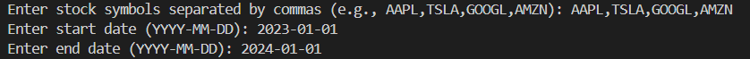
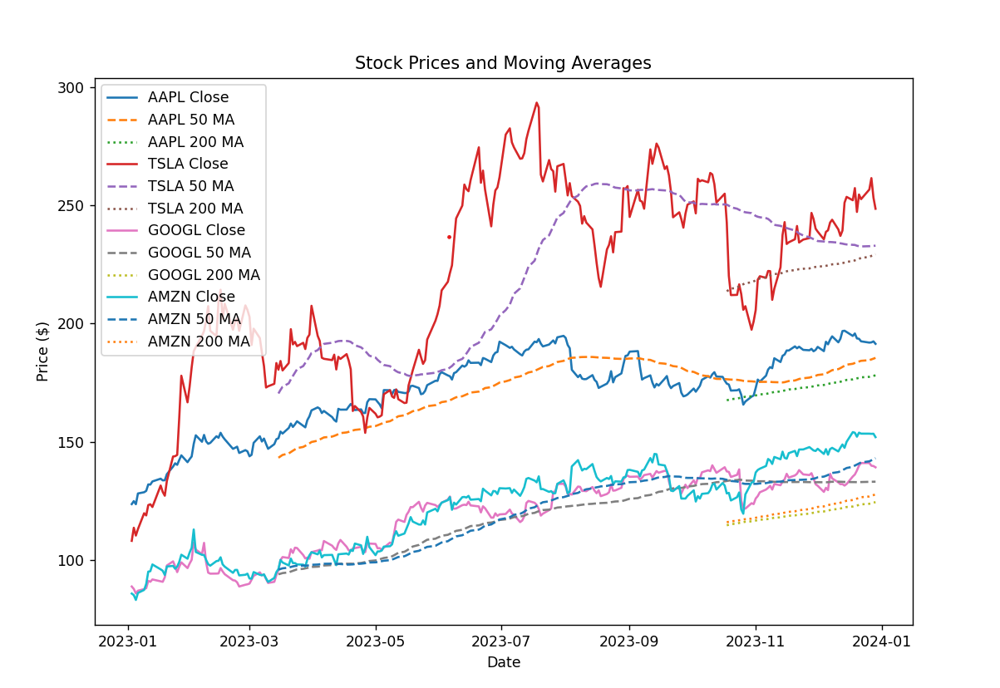
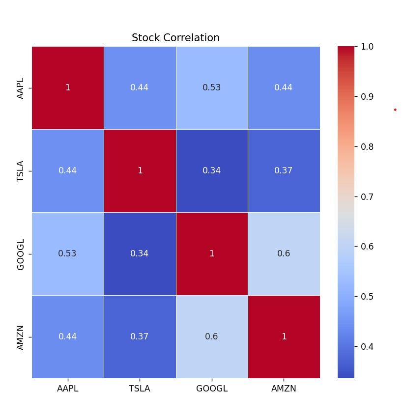

````markdown
# Yahoo Finance Stock Analysis

This project allows users to analyze **any publicly traded stock** available on **Yahoo Finance**. Users can enter their preferred stock tickers (e.g., **AAPL, TSLA, GOOGL, AMZN**) and analyze their **price trends, moving averages, and correlations**.

---

## Features

**Download historical stock data** using `yfinance`  
 **User-defined stock selection** (analyze any stock available on Yahoo Finance)  
 **Calculate key financial indicators:**

- **Daily Return**
- **50-day Moving Average (50 MA)**
- **200-day Moving Average (200 MA)**
- **Stock Volatility**
  **Visualize stock price trends with moving averages**  
  **Stock return correlation heatmap**

---

## Technologies Used

- **Python 3.12**
- **Libraries:** `yfinance`, `pandas`, `numpy`, `matplotlib`, `seaborn`

---

## Results & Example Data

### Stock Prices and Moving Averages

This chart shows the **daily closing prices** of the selected stocks along with their **50-day and 200-day moving averages**. It helps identify **trends and potential support/resistance levels**.

**User Input Example:**  


**Generated Stock Prices Chart:**  


---

### Stock Correlation Heatmap

This heatmap visualizes the **correlation between the daily returns** of the selected stocks. A **higher value** indicates a **stronger relationship**.

**Stock Correlation Heatmap:**  


---

## Installation & Usage

### Clone the repository:

```sh
git clone https://github.com/melek/yahoo-finance-analysis.git
cd yahoo-finance-analysis
```
````

### Install required dependencies:

```sh
pip install -r requirements.txt
```

### Run the script:

```sh
python main.py
```

### Enter stock tickers and other details when prompted.

## Why Use This Project?

**Analyze any stock on Yahoo Finance**\
 **Compare multiple stocks on the same graph**\
 **Get insights into stock correlations**\
 **Adjustable parameters to customize analysis**

```

```
